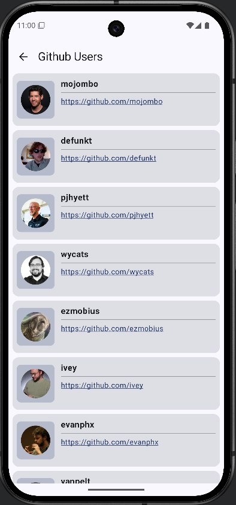
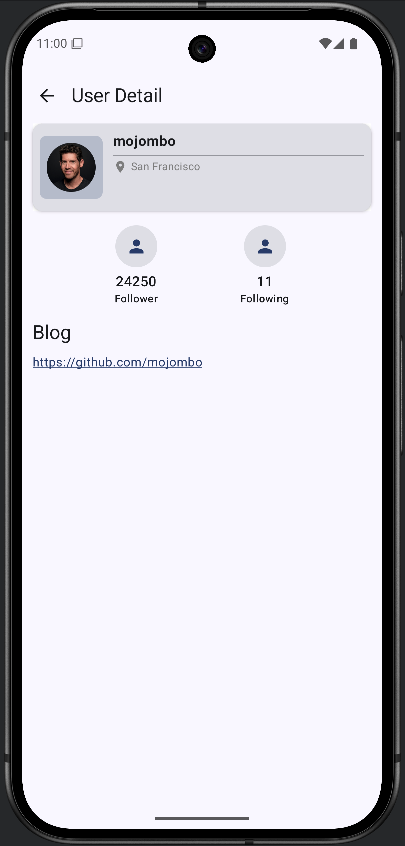

# GitHub User Browser

This Android project allows administrators to browse GitHub users and view detailed information about them. 

---

## Acceptance Criteria

- The administrator can look through fetched users’ information.
- The administrator can scroll down to see more users’ information with 20 items per fetch.
- Users’ information must be shown immediately when the administrator launches the application for the second time (cache support).
- Clicking on a user will navigate to the detail page of that user.

---

## Features

- Paginated user browsing using GitHub API.
- User detail screen showing extended information.
- Caching of user data for offline and fast relaunch experience.
- Responsive and user-friendly UI built with Jetpack Compose.

---

## 🛠️ Technologies & Architecture

### Tech Stack

- **Language**: Kotlin
- **UI**: Jetpack Compose — for building modern declarative UIs
- **Architecture**: MVVM + Clean Architecture + Modularization
- **State Management**: Kotlin `Flow` + `ViewModel`
- **Modularization**: Organized into distinct modules for scalability and separation of concerns

### Pagination & Caching

- **Paging 3**: Used with `RemoteMediator` to load and paginate data from the GitHub API efficiently
- **Offline-First Strategy**:
    - Automatically fetches data from the local `Room` database when offline
    - Synchronizes with remote data when the network is available

### Networking

- **Retrofit**: For making API requests to the [GitHub Users API](https://docs.github.com/en/rest/users/users?apiVersion=2022-11-28)

### Local Data Storage

- **Room Database**: Stores paginated GitHub user data locally
- **DataStore**: Used to persist small data (e.g., token, flags) in a type-safe, asynchronous way
- **Android Keystore**: Secures sensitive data such as access tokens using encrypted keys

### Testing

- **JUnit**: For unit testing business logic and ViewModels
- **MockK**: For mocking dependencies and verifying interactions
- **Kover**: For measuring code coverage in Kotlin projects

---

### Preview

⚠️ **Warning**
> If the app cannot call the GitHub API using the mock access token,  
> please input your **GitHub personal access token** in the `mockAccessToken()` function manually.  
> This is required for authenticated requests to avoid rate limits.